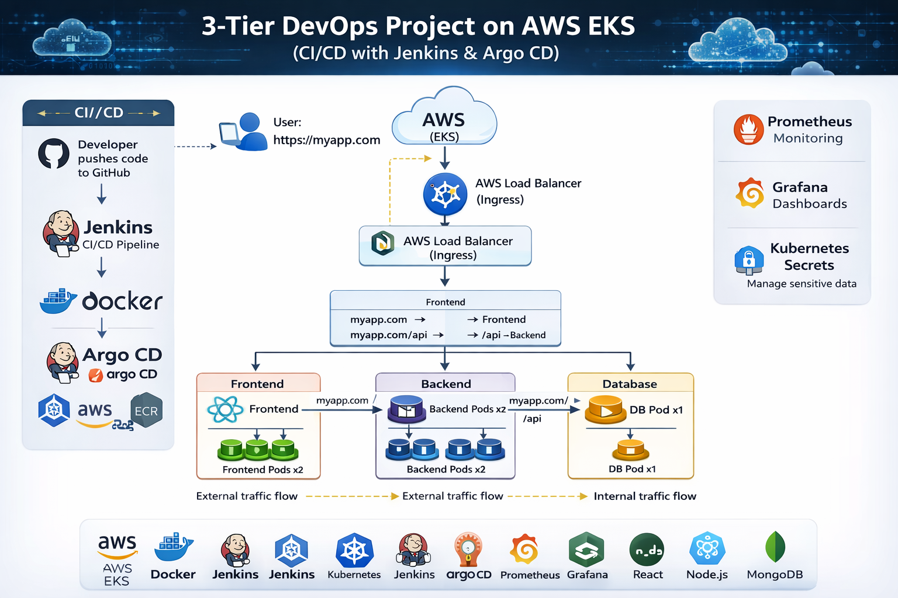

# 🚀 3-Tier DevOps Project on AWS EKS (CI/CD with Jenkins & Argo CD) :

This project demonstrates a **production-like end-to-end DevOps pipeline** using a **3-tier architecture** deployed on **AWS EKS (Kubernetes).** with a complete **CI/CD pipeline using Jenkins and Argo CD (GitOps model)**.

🧩 Application Components:
  * Frontend – React
  * Backend – Node.js API
  * Database – MongoDB

-----------------------------------------------------------------------------------------------

## 🛠️ Tech Stack & Tools :

| Category       |   Tools Used           |
| ---------------| ---------------------- |
| Cloud          |  AWS (EKS, ECR, ELB)   |
| Container      |  Docker                |
| Orchestration  |  Kubernetes            |
| CI/CD          |  Jenkins, Argo CD      |
| Monitoring     |  Prometheus, Grafana   |
| Frontend       |  React                 |
| Backend        |  Node.js               |
| Database       |  MongoDB               |

----------------------------------------------------------------------------------------------------

## 🏗️ Application Architecture :

  

User
→ AWS Load Balancer (Ingress)
→ Frontend (React)
→ Backend (Node.js API)
→ MongoDB

---

## ⚙️ CI/CD Workflow :

1. Developer pushes code to GitHub
2. Jenkins pipeline is triggered
3. Docker images are built (Frontend & Backend)
4. Images are pushed to AWS ECR
5. Kubernetes manifests are updated
6. Argo CD detects changes (GitOps)
7. Application is deployed to AWS EKS

---

## ☸️ Kubernetes Components

* Frontend Deployment

* Backend Deployment

* MongoDB Deployment

* Services for internal communication

* Ingress / AWS Load Balancer for external access

* Kubernetes Secrets for storing MongoDB credentials

---

## 📊 Monitoring & Observability

* Prometheus collects cluster and application metrics
* Grafana visualizes CPU, memory, and pod performance

---

## 🔐 Security

* Sensitive data is managed using Kubernetes Secrets

---

## 🚀 Features :
 
* ✅ 3-tier architecture (Frontend, Backend, Database)
* ✅ Dockerized microservices
* ✅ CI/CD pipeline with Jenkins
* ✅ GitOps deployment using Argo CD
* ✅ Kubernetes deployment on AWS EKS
* ✅ Monitoring with Prometheus & Grafana
* ✅ AWS Load Balancer (Ingress)

---

## ⭐ Conclusion :

This project demonstrates real-world DevOps practices including :
* CI/CD automation
* GitOps deployment
* Kubernetes orchestration
* Monitoring and observability

